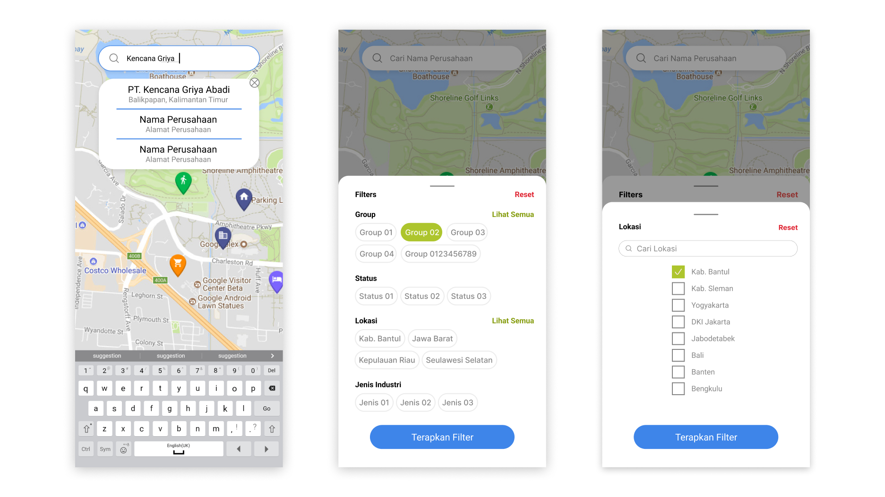

# SOMESTA Customer Viewer

## Apa itu SOMESTA?
Aplikasi android untuk melihat pin lokasi dan informasi customer (perusahaan) PT. Pertamina di indonesia.

## Fitur aplikasi
- Menampilkan marker untuk menunjukan lokasi customer pada map.
- Mencari perusahaan dan menampilkan lokasinya.
- Filter untuk Map.
- Menampilkan informasi customer sesuai marker yang di klik.
- Sistem login & logout.
- Update marker dan informasi perusahaan *hampir secara realtime.
- Menampilkan total kebutuhan & market share pada perusahaan yang ter-filter.

## SOMESTA development team (former)
- Project Manager: Andhika
- System Analyst: Revan & Andhika
- Lead Concept & Designer: Andhika & Rangga
- Lead Android Programmer: Revan
- Lead Web Frontend & Backend Developer: Rangga
- Lead SysAdmin & Backend: Andhika

## Tampilan SOMESTA
